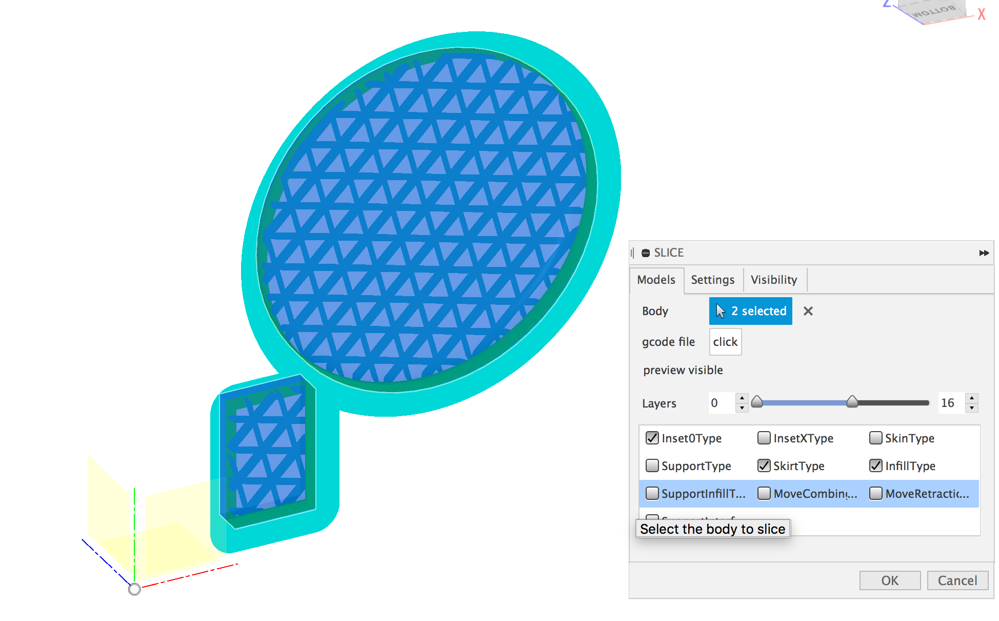
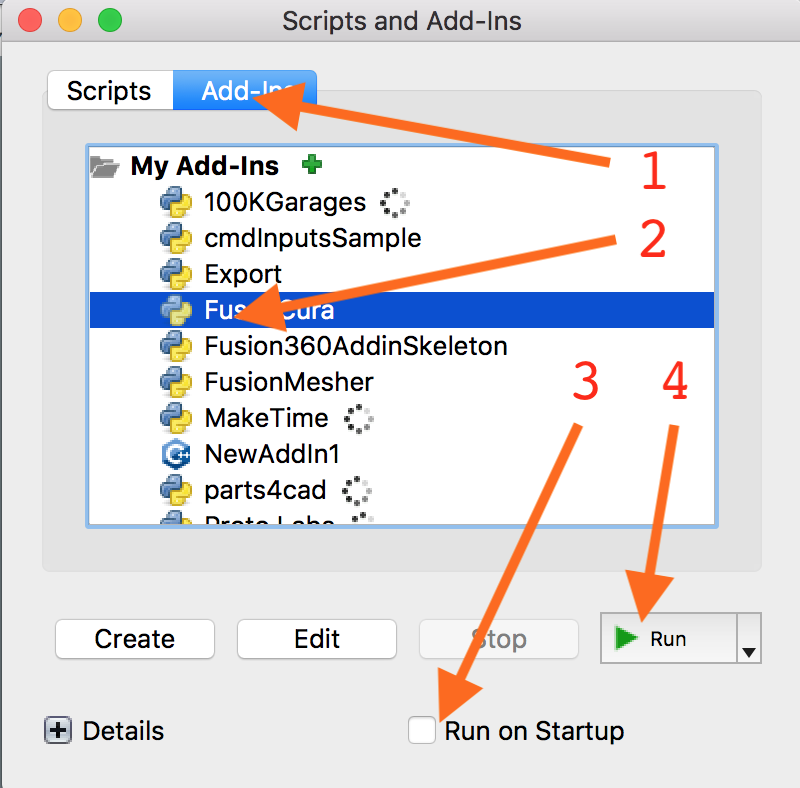

# FusedCura

An integration of Fusion 360 with Cura Engine allows direct slicing in your modeler.

It is a first stab at the problem.

## What works
    - single printer
    - all slicing parameters

## Install
To install this Add-In, [download the zip file](https://github.com/nraynaud/FusedCura/archive/master.zip) 
and install it in the [relevant AddIn directory](https://knowledge.autodesk.com/support/fusion-360/troubleshooting/caas/sfdcarticles/sfdcarticles/How-to-install-an-ADD-IN-and-Script-in-Fusion-360.html).

You can then find the AddIn with the associated toolbar button .

The aforementioned button will display a panel where a simple 4 clicks strategy is appropriate (you should make sure "Run on Startup" is checked, unlike the picture):

Upon running, the Add-In should display a new "SLICE" entry in the toolbar, a down pointing arrow betraying the existence 
of a configuration menu.

You will then need to install CuraEngine, the easiest way to do so is to install [Cura](https://github.com/Ultimaker/Cura/releases/tag/3.4.1).

The last step is to connect the dots in Fusion 360 by the SLICE->"FusedCura Configuration" sequence, where a panel will allow 
 to teach the location of the curaengine executable. It should be located next to the Cura executable in the installation 
 directory (/Applications/Ultimaker Cura.app/Contents/MacOS/CuraEngine on macos).
 

## TODO:
    - muti extruder
    - per model settings
    - meshes (ironically)
    - direct connection to the printer's web interface
    
## Written by 
Nicolas Raynaud

Software contractor for hire