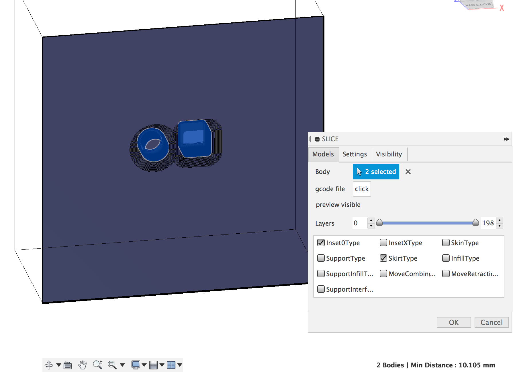
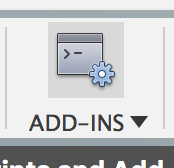

# FusedCura

An integration of Fusion 360 with Cura Engine allows direct slicing in your modeler.

It is a first stab at the problem.

## Motivation
The immediate aim is to reduce the iteration time when fiddling with the model and the slicer by having the slicer 
configuration stored in the model document. It also helps to have the same 3D camera controls for everything and not be 
fumbling with shift+center button drag or was it alt+right drag?

In the future, depending on traction, I might start to integrate the slicer tighter for things like parameters per face.

## How it works
This is mostly a tool to manage slicing parameters. Machine and Extruder configuration are saved in a file on disk, 
while the model parameters are saved as [attributes](https://help.autodesk.com/view/fusion360/ENU/?guid=GUID-BAF017FE-10B8-4612-BDE2-0EF5D4C6F800) in the model.

## What works
    - single printer
    - all slicing parameters

## Install
To install this Add-In, [download the zip file](https://github.com/nraynaud/FusedCura/archive/master.zip) 
and install it in the [relevant AddIn directory](https://knowledge.autodesk.com/support/fusion-360/troubleshooting/caas/sfdcarticles/sfdcarticles/How-to-install-an-ADD-IN-and-Script-in-Fusion-360.html).

You can then find the AddIn with the associated toolbar button .

The aforementioned button will display a panel where a simple 4 clicks strategy is appropriate (you should make sure "Run on Startup" is checked, unlike the picture):

Upon running, the Add-In should display a new "SLICE" entry in the toolbar, a down pointing arrow betraying the existence 
of a configuration menu.

You will then need to install CuraEngine, the easiest way to do so is to install [Cura](https://github.com/Ultimaker/Cura/releases/tag/3.4.1).

The last step is to connect the dots in Fusion 360 by the SLICE->"FusedCura Configuration" sequence, where a panel will allow 
 to teach the location of the curaengine executable. It should be located next to the Cura executable in the installation 
 directory (/Applications/Ultimaker Cura.app/Contents/MacOS/CuraEngine on macos).
 

## TODO:
    - per model settings
    - meshes (ironically)
    - direct connection to the printer's web interface
    
## Written by 
Nicolas Raynaud,

Software contractor for hire.